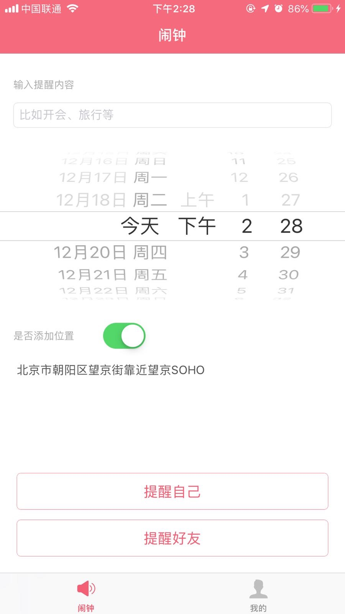

# iOSQClock
#### 1、关于企鹅闹钟的位置使用信息

* 您可以在创建闹钟的时候带上您目前的位置，用来分享给好友时带上您目前的位置信息

#### 2、关于企鹅闹钟的通知使用信息

* 您在给自己创建闹钟的时候会用到系统的通知权限，这样在您预定好的时间就会收到系统的通知
  
#### 3、创建闹钟

* 创建闹钟
* 输入提醒的内容
* 选择时间
* 选择是否添加位置
* 提醒自己
* 提醒好友

#### 、我的闹钟

* 查看添加闹钟的记录

